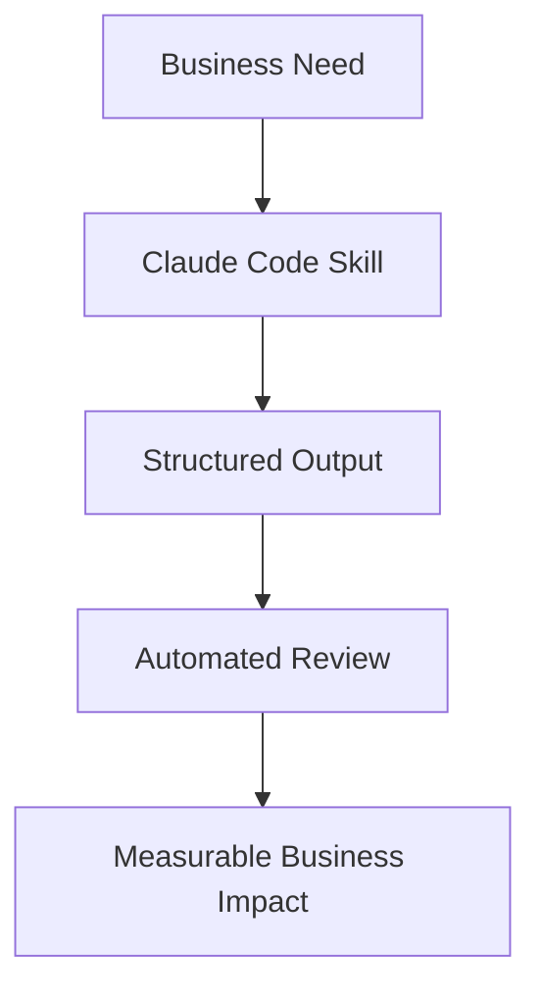

# 🚀 Claude Code Skills — Business Value

> **Turn AI skills into real-world business outcomes.**
> This repository shows how structured Claude Code skills translate directly into measurable value across products, operations, marketing, and growth.

---

## 📌 What This Repository Is For

This project demonstrates how well-designed Claude Code skills can be used to:

* Ship higher-quality software faster
* Reduce operational and review overhead
* Improve content and SEO performance
* Standardize AI-assisted workflows
* Scale teams without scaling chaos

**Bottom line:** it helps organizations convert AI capability into repeatable business impact.

---

## 💼 Core Business Use Cases

### ⚡ 1. Faster Product & Feature Delivery

**Problem:** Engineering teams lose time to unclear specs, inconsistent code quality, and rework.

**How the skills help:**

* Enforce structured development workflows
* Standardize code generation quality
* Catch issues early via automated review checklists
* Reduce back-and-forth in PR reviews

**Business impact:**

* Shorter development cycles
* Lower engineering costs
* Faster time-to-market
* More predictable delivery

---

### 🧠 2. AI-Augmented Engineering at Scale

**Problem:** Teams adopt AI unevenly, creating inconsistent outputs and technical debt.

**How the skills help:**

* Provide guardrails for AI-generated code
* Ensure consistent architecture patterns
* Embed best practices into every generation
* Create repeatable AI workflows

**Business impact:**

* Safe AI adoption across teams
* Reduced technical debt risk
* Higher trust in AI outputs
* Easier onboarding of new engineers

---

### 📈 3. Content, SEO & AEO Performance Gains

**Problem:** Marketing teams struggle to produce optimized, high-quality content consistently.

**How the skills help:**

* Structure content for Answer Engine Optimization (AEO)
* Standardize SEO best practices
* Improve readability and engagement
* Enable scalable content pipelines

**Business impact:**

* Higher search visibility
* Better organic traffic
* Increased conversion potential
* Lower content production cost

---

### 🔍 4. Quality Assurance & Review Automation

**Problem:** Manual reviews are slow, inconsistent, and expensive.

**How the skills help:**

* Enforce `reviewchecklist.md` automatically
* Flag common issues before human review
* Standardize quality gates
* Reduce reviewer fatigue

**Business impact:**

* Fewer production bugs
* Faster PR approvals
* Lower QA overhead
* More reliable releases

---

### 🏢 5. Operational Standardization

**Problem:** Growing teams develop fragmented workflows and tribal knowledge.

**How the skills help:**

* Document repeatable processes
* Encode best practices into `skills.md`
* Create shared team standards
* Reduce dependency on individual experts

**Business impact:**

* Easier scaling
* Faster onboarding
* Lower knowledge risk
* More predictable operations

---

## 🧩 How It Works (Simple Flow)

**Translation:** less guesswork → more consistency → better results.

---

## 🎯 Who Gets the Most Value

### 🛠 Engineering Teams

* AI-assisted coding with guardrails
* Cleaner pull requests
* Reduced rework cycles

### 📊 Product & Startup Teams

* Faster MVP iteration
* More predictable delivery
* Leaner development costs

### 📣 Marketing & Growth Teams

* Scalable SEO/AEO content
* Consistent brand voice
* Higher search performance

### 🏢 Enterprise Organizations

* Standardized AI adoption
* Risk-controlled automation
* Cross-team consistency

---

## 📉 Measurable ROI Areas

Organizations typically see improvements in:

* ⏱ Development velocity
* 🐞 Defect reduction
* 📈 Organic traffic
* 💰 Cost per feature/content piece
* 🔁 Review cycle time
* 🚀 Time to production

---

## 🧪 Example Business Scenarios

### Scenario 1 — Startup Shipping Faster

A SaaS startup uses these skills to standardize AI-generated code.

**Result:**

* Faster MVP launches
* Fewer regressions
* Smaller engineering team required

---

### Scenario 2 — Content Team Scaling SEO

A growth team applies the structured content rules.

**Result:**

* More pages published per week
* Improved SERP visibility
* Higher inbound traffic

---

### Scenario 3 — Enterprise AI Governance

A large organization embeds the review checklist into CI.

**Result:**

* Controlled AI usage
* Consistent code quality
* Reduced compliance risk

---

## 🔐 Why This Approach Works

**Traditional AI usage:**

* Ad hoc
* Inconsistent
* Hard to trust
* Difficult to scale

**Skill-driven approach:**

* Structured
* Repeatable
* Reviewable
* Enterprise-ready

That shift is what converts AI from a novelty into a **reliable business system**.

---

## 🚀 Getting Started

1. Review `skills.md` to understand capability coverage
2. Apply `reviewchecklist.md` in your workflow
3. Integrate into your Claude Code processes
4. Measure impact on speed, quality, and output

---

## 🤝 Final Takeaway

**Claude Code skills are not just about better AI output — they are about building a scalable business engine.**

When implemented correctly, they help teams:

* Move faster
* Break less
* Rank higher
* Scale smarter

